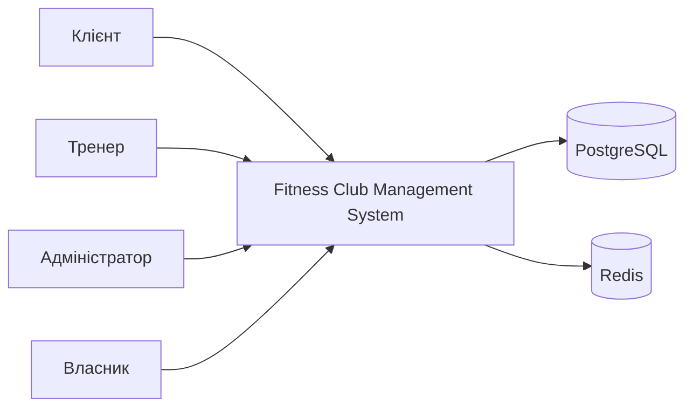
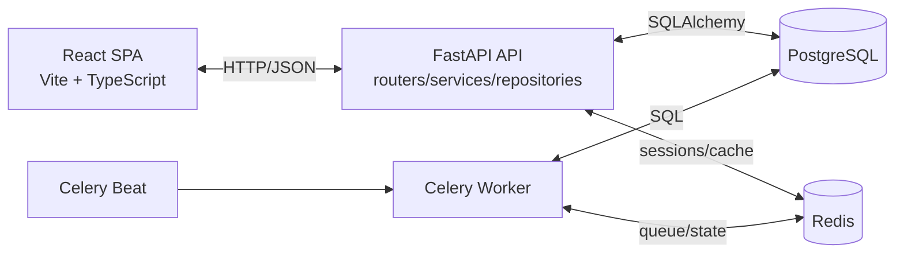
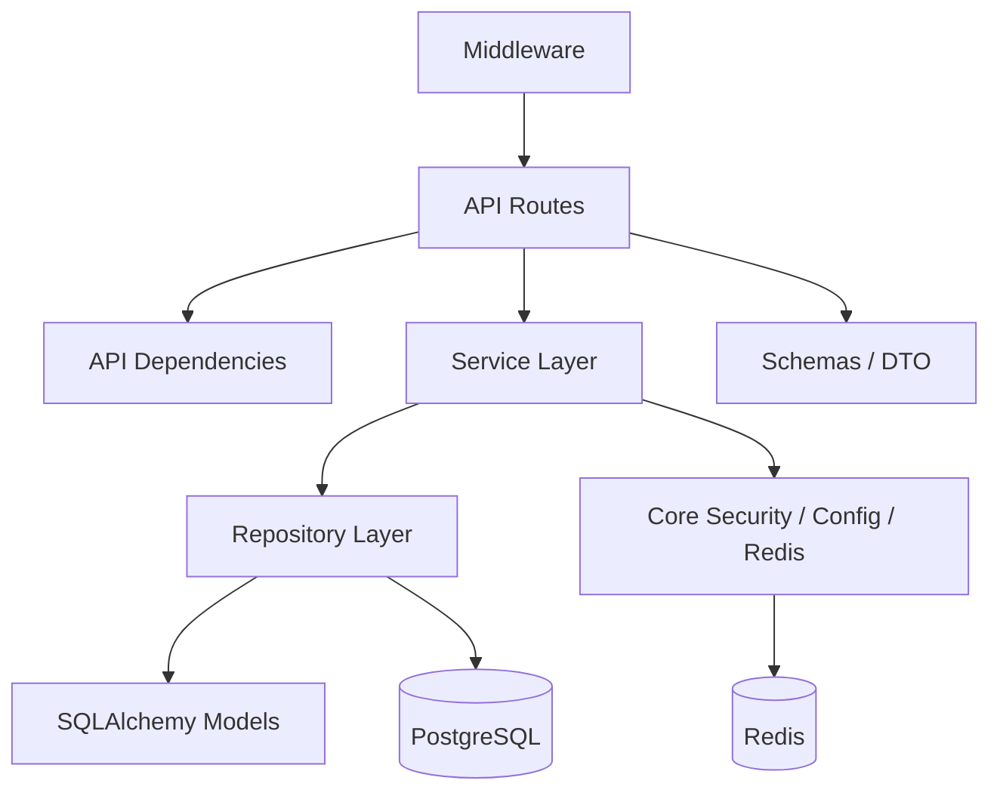
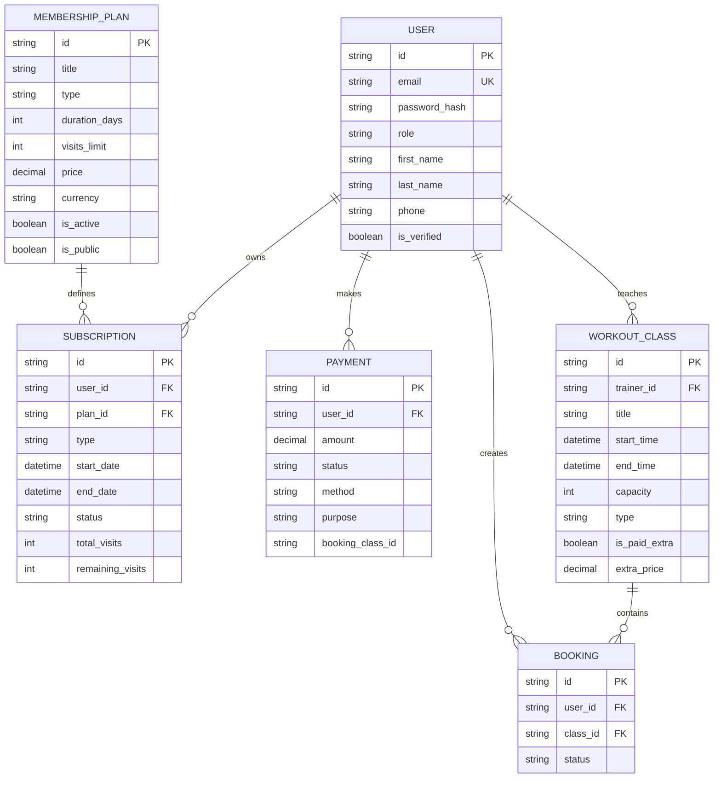

# Лабораторна робота №2

## Тема

Проєктування архітектури програмного забезпечення та моделювання даних для
**Fitness Club Management System**.

## Мета роботи

Обґрунтувати вибір стеку, описати архітектуру системи за моделлю C4 та побудувати
схему даних, яка покриває основні доменні сутності клубу.

## Обраний технологічний стек

| Шар | Технології | Обґрунтування |
|---|---|---|
| Backend | FastAPI, Pydantic v2 | швидка побудова typed REST API та Swagger/OpenAPI з коробки |
| ORM | SQLAlchemy 2.0 Async | чіткий контроль моделі даних і транзакцій |
| Міграції | Alembic | версіонування схеми БД і контроль змін |
| БД | PostgreSQL | надійна реляційна БД для транзакційних сценаріїв |
| Cache / sessions | Redis | зберігання сесій, rate limit, revoke flow |
| Background jobs | Celery + Celery Beat | запуск reminder- та maintenance-задач |
| Frontend | React 19 + TypeScript + Vite | швидкий SPA-стек з суворою типізацією |
| Client state | Zustand | компактний store для auth/session |
| Server state | TanStack Query | кешування, refetch та інвалідація даних |
| DevOps | Docker Compose | простий локальний запуск усіх сервісів |

## C4: System Context

Система є єдиною точкою взаємодії для всіх ролей і працює поверх PostgreSQL та Redis.

## C4: Container Diagram

Контейнери розділено так, щоб окремо масштабувати web, API і фон.

## C4: Component Diagram для API Application

Уся складна логіка винесена з роутів у сервіси, а доступ до БД ізольований у репозиторіях.

## ER-модель

## Нормалізація та ключові індекси

- `users.email` - унікальний індекс для логіну.
- `workout_classes.start_time` - швидкий пошук розкладу.
- `subscriptions.status` і `subscriptions.end_date` - звіти та reminder-задачі.
- `bookings(user_id, class_id)` - захист від дубльованого бронювання.
- `payments.created_at` - історія платежів і звіти.

## Короткі відповіді для захисту

1. C4 показує систему на трьох рівнях деталізації: контекст, контейнери й компоненти.
2. PostgreSQL обрано через транзакційність і чіткі зв'язки між сутностями.
3. CAP вказує, що у розподіленій системі неможливо одночасно максимізувати консистентність, доступність і стійкість до мережевого розділення.
4. Для цього проєкту modular monolith кращий за мікросервіси, бо дає нижчу складність при достатній масштабованості.

## Висновок

На етапі Лабораторної №2 сформовано цілісну архітектурну модель системи.
Обраний стек напряму підтримує транзакційні сценарії клубу, а C4- і ER-діаграми
узгоджують вимоги Лабораторної №1 з реальною структурою коду.
