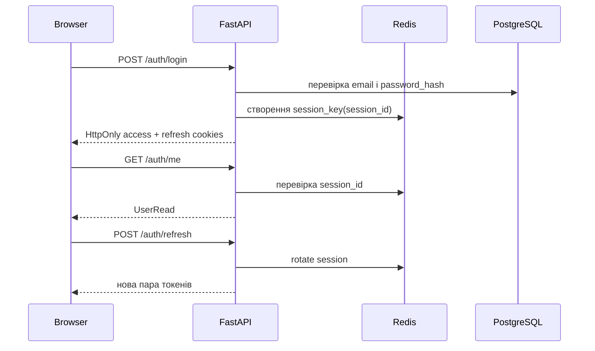

# Лабораторна робота №4

## Тема

Реалізація підсистеми безпеки, автентифікації та авторизації для
**Fitness Club Management System**.

## Мета роботи

Побудувати безпечний auth flow, захистити API від несанкціонованого доступу та
реалізувати role-based доступ для різних категорій користувачів.

## Реалізована модель користувача

Сутність `User` містить такі ключові поля:

- `email`
- `password_hash`
- `role`
- `first_name`
- `last_name`
- `phone`
- `is_verified`

Ролі системи:

- `CLIENT`
- `TRAINER`
- `ADMIN`
- `OWNER`

## Захист паролів

- паролі не зберігаються у відкритому вигляді;
- під час реєстрації використовується хешування через `Argon2`;
- перевірка пароля під час логіну виконується через `verify_password(...)`.

## Реалізований authentication flow

## Основні механізми безпеки

| Механізм | Реалізація |
|---|---|
| Паролі | Argon2 hash |
| Сесія | JWT access + refresh у `HttpOnly` cookies |
| Rotation | refresh token rotation через Redis session key |
| RBAC | `require_roles(...)` |
| CSRF | `CSRFMiddleware` + `X-CSRF-Token` |
| Idle timeout | окремий timeout для `ADMIN` і `OWNER` |
| Rate limit | Redis-лічильники для auth endpoint'ів |
| Audit | логування `register`, `login`, `refresh`, `logout`, failed login |

## Матриця доступу

| Модуль | Public | Client | Trainer | Admin | Owner |
|---|---|---|---|---|---|
| Реєстрація / логін | так | так | так | так | так |
| Профіль | ні | так | так | так | так |
| Мої бронювання | ні | так | ні | ні | ні |
| Мої класи | ні | ні | так | ні | ні |
| Користувачі | ні | ні | ні | так | так |
| Звіти | ні | ні | ні | так | так |
| Публічні плани | так | так | так | так | так |

## Інтеграція із захищеним API

- без access cookie запит до protected route завершується `401 Unauthorized`;
- при недостатній ролі повертається `403 Forbidden`;
- для mutating-запитів без CSRF-токена повертається `403`;
- прострочена або видалена refresh-сесія повертає `401`.

## Результати тестування

На момент оформлення звіту система проходить:

- auth integration tests;
- security tests;
- route unit tests;
- smoke-перевірку логіну, `/auth/me`, `/auth/logout`.

Актуальний підсумок на 2026-03-25:

- `50/50` backend-тестів успішні.

## Короткі відповіді для захисту

1. Автентифікація підтверджує особу користувача, авторизація вирішує, що саме йому дозволено.
2. Паролі не можна зберігати відкрито, бо компрометація БД одразу розкриє всі облікові записи.
3. JWT містить `header`, `payload`, `signature`, а роль користувача зберігається у `payload`.
4. RBAC дає змогу централізовано обмежувати доступ на основі ролі без дублювання логіки по всьому коду.
5. Refresh token у проєкті реалізовано як бонусний механізм для оновлення сесії без повторного логіну.

## Висновок

У межах Лабораторної №4 реалізовано повноцінну підсистему безпеки: хешування
паролів, cookie-based JWT auth, refresh rotation, CSRF, RBAC, rate limit і аудит.
Це дало змогу безпечно інтегрувати фронтенд із захищеним API.
