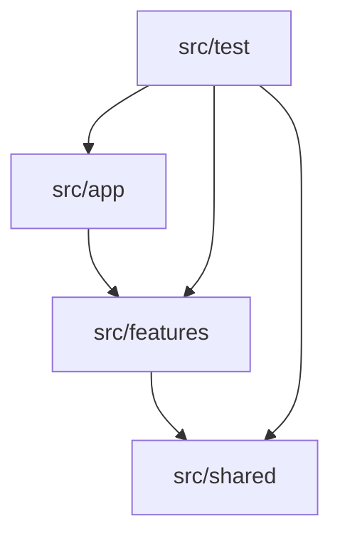

# Лабораторна робота №5

## Тема

Розробка клієнтської частини (Front-end) та інтеграція з API для
**Fitness Club Management System**.

## Мета роботи

Створити SPA-клієнт, який працює із захищеним REST API, підтримує auth flow,
protected routes, CRUD-операції та зручний інтерфейс для різних ролей користувачів.

## Архітектура фронтенду

Структура організована за feature-based підходом: бізнес-функціональність лежить у
`features`, а перевикористовувані API й UI - у `shared`.

## Реалізовані сторінки

| Сторінка | Призначення |
|---|---|
| `HomePage` | маркетингова головна сторінка |
| `LoginPage` | форма входу |
| `DashboardPage` | загальний огляд системи |
| `ProfilePage` | профіль поточного користувача |
| `SchedulePage` | перегляд і фільтрація занять |
| `BookingsPage` | список моїх бронювань |
| `SubscriptionsPage` | абонементи клієнта і management flow |
| `PaymentsPage` | історія оплат |
| `MyClassesPage` | сторінка класів для тренера й менеджменту |
| `UsersPage` | керування користувачами й підписками |
| `ReportsPage` | доходи і популярність тренерів |

## HTTP-клієнт та інтеграція з API

- усі HTTP-виклики винесені у `shared/api`;
- компоненти не викликають `fetch` напряму;
- `http.ts` автоматично додає `credentials: include`;
- для mutating-запитів додається CSRF header;
- при `401` виконується автоматична спроба `POST /auth/refresh`.

## Реалізація автентифікації на UI

1. `LoginPage` відправляє облікові дані на backend.
2. Після успішного логіну браузер отримує `HttpOnly` cookies.
3. `AuthBootstrap` викликає `/auth/me` і відновлює стан користувача.
4. `ProtectedLayout` не пропускає неавторизованого користувача до dashboard.
5. `RoleBoundary` фільтрує маршрути відповідно до ролі.

## Protected Routes

| Маршрут | Умова доступу |
|---|---|
| `/dashboard/*` | лише авторизований користувач |
| `/dashboard/bookings` | лише `CLIENT` |
| `/dashboard/my-classes` | `TRAINER`, `ADMIN`, `OWNER` |
| `/dashboard/users` | лише `ADMIN` або `OWNER` |
| `/dashboard/reports` | лише `ADMIN` або `OWNER` |

## CRUD-можливості UI

| Модуль | Можливості |
|---|---|
| Users | створення, редагування, видалення користувачів |
| Schedules | перегляд, створення, редагування, видалення занять |
| Subscriptions | купівля, freeze, issue, edit, restore, delete |
| Bookings | create, cancel, підтвердження оплати extra-class |
| Payments | перегляд історії клієнта та реєстру платежів |
| Classes | історія занять, список учасників, підтвердження завершення з коментарем |

## UX та обробка помилок

- українська локалізація інтерфейсу;
- loading states та empty states;
- Zod-контракти для перевірки структури відповіді API;
- повідомлення про втрату сесії через подію `fcms:auth-expired`;
- інвалідація кешу після мутацій через `TanStack Query`.
- dashboard-сторінки спрощені до одного головного заголовка й пояснення без дубльованих шапок.

## Результати тестування

Фронтенд перевіряється через `Vitest` та `Testing Library`.

Актуальний стан на 2026-03-25:

- `66/66` frontend-тестів проходять успішно;
- покриття фронтенду: `86.3%`.

## Короткі відповіді для захисту

1. SPA завантажує оболонку один раз і далі оновлює інтерфейс без повного reload сторінки.
2. Client-side routing використовує History API і дозволяє перемикати сторінки всередині SPA.
3. Для цього проєкту безпечніше зберігати токени в `HttpOnly cookies`, а не в `localStorage`.
4. CORS потрібен, бо фронтенд і бекенд у dev-середовищі працюють на різних origin.
5. Global state доречний для auth/session, тоді як локальний state зручний для форм і модалок.

## Висновок

У межах Лабораторної №5 реалізовано повноцінний React SPA-клієнт із захищеними
маршрутами, role-based навігацією, централізованим API-шаром і CRUD-інтерфейсами.
Фронтенд інтегрований із бекендом і готовий до демонстрації повного користувацького циклу.
